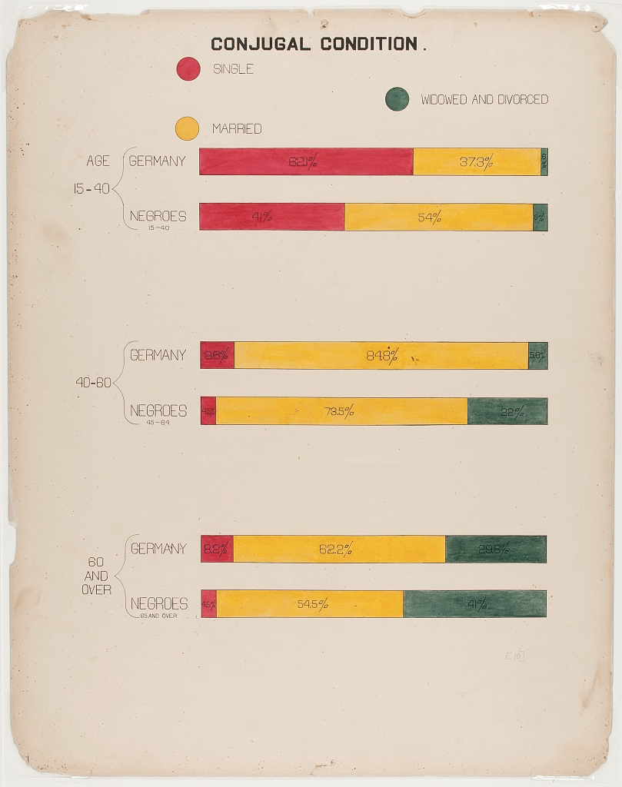

```{r setup, include=FALSE}
knitr::opts_chunk$set(echo = FALSE, fig.path = "plots/", fig.width = 8, fig.height =5)
library(tidyverse)

#tuesdata <- tidytuesdayR::tt_load('2021-02-16')
conjugal <- readr::read_csv('https://raw.githubusercontent.com/rfordatascience/tidytuesday/master/data/2021/2021-02-16/conjugal.csv')
```

# Original Image

The original chart was prepared by Du Bois for the Negro Exhibit of the American Section at the Paris Exposition Universelle in 1900 to show the economic and social progress of African Americans since emancipation. This particular graph shows the marital status of African Americans compared to Germans, by age group. 

```{r, echo = FALSE}

```

# Replication

We can replicate the graph in `ggplot2` using a facetted barplot with custom colors and fonts. While this isn't a perfect recreation, it's true to the style of the original. Many thanks to the folks at TidyTuesday as well as Anthony Starks, Allen Hillery, and Sekou Tyler for putting the challenge together (including creating a [Du Bois style guide](https://github.com/ajstarks/dubois-data-portraits/blob/master/dubois-style.pdf))!

```{r dubois-replication, fig.width= 6, fig.height= 9}
dubois_color = c("#4a6554", "#f1b834", "#b53541")
bg_color = "#e4d7ca"

conjugal %>%
  pivot_longer(-c(Population, Age), names_to = "status", values_to = "percent") %>%
  mutate(
    Population = fct_rev(toupper(Population)),
    status = toupper(status),
    Age = fct_inorder(case_when(
      Age == "15-40" ~ "AGE\n15-40",
      Age == "40-60" ~ Age,
      TRUE ~ "60\nAND\nOVER"
    ))
  ) %>%
  ggplot(., aes(y = Population, x = percent, fill = status)) + 
  geom_col(width = .3) + 
  geom_text(aes(label = paste0(percent, "%")), position = position_stack(vjust = .5), size = 4, family = "Bai Jamjuree", color = "gray25") +
  facet_grid(rows = vars(Age), switch = "y") + 
  labs(
    title = "CONJUGAL CONDITION .",
    y = " ",
    x = " ",
    fill = ""
  ) +
  scale_fill_manual(values = dubois_color,
                    guide = guide_legend(override.aes = list(shape = 21),
                                         reverse = TRUE)) +
  theme_minimal() +
  theme(
    legend.position = "top",
    panel.background = element_rect(fill = bg_color, color = bg_color),
    plot.background = element_rect(fill = bg_color),
    panel.grid = element_blank(),
    panel.border = element_blank(),
    strip.text.y.left = element_text(angle = 0, color = "gray25"),
    axis.text.y = element_text(color = "gray25"), 
    axis.text.x = element_blank(),
    strip.placement = "outside",
    text = element_text(family = "Bai Jamjuree", color = "gray25", size = 14),
    plot.title = element_text(size = 16, face = "bold", hjust = .5, family = "Airborne II Pilot"),
    panel.spacing = unit(2, "lines")
  )
```


# Code

```{r ref.label=knitr::all_labels(), echo=TRUE, eval=FALSE}

```
