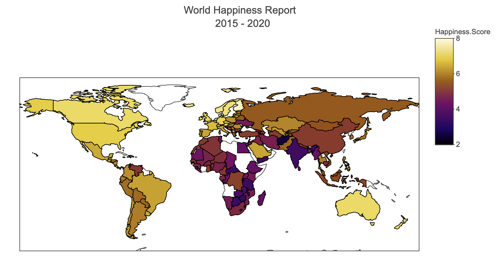

```{r setup, include=FALSE}
knitr::opts_chunk$set(echo = FALSE)
```

# Links

[External Link to Project](https://tatabas.shinyapps.io/Stat41_finalproject/)

[Github](https://github.com/tatabas/Stat41_finalproject)

# Full Report

```{r}
knitr::include_app("https://tatabas.shinyapps.io/Stat41_finalproject/", height = "800px")
```

```{r, preview = TRUE}

```
