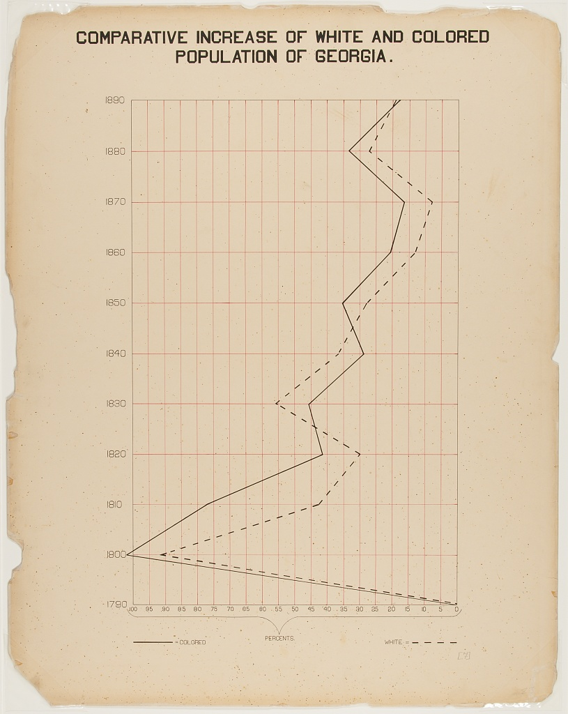

```{r setup, include=FALSE}
knitr::opts_chunk$set(echo = FALSE)

library(tidyverse)
library(ggplot2)
library(dbplyr)
library(tidyr)

georgia_pop <- readr::read_csv('https://raw.githubusercontent.com/rfordatascience/tidytuesday/master/data/2021/2021-02-16/georgia_pop.csv')
```

This graph is a representation of growth in population of the Colored and White races over time in the state of Georgia. Over the course of making this graph, I learned a lot of tricks about how to use R to plot, theme, and write legends. It was a struggle, essentially starting from scratch, but I am pleased to have come up with this result and look forward to creating more graphs in the future!

```{r, layout="l-body-outset", fig.width = 10, fig.height=6}
georgia_pop %>%
  ggplot() + 
  geom_line(aes(x = Year, y = Colored, linetype = "dashed")) + 
  geom_line(aes(x = Year, y = White, linetype = "solid")) +
  labs(
    title = "COMPARATIVE INCREASE IN POPULATIONS OF COLORED AND WHITE PEOPLE IN GEORGIA",
    x = "Year", 
    y = "Percent Increase",
    linetype = "Race") +
    scale_linetype_manual(labels = c("Colored", "White"), values = c("dashed", "solid"))
```

# Original Graph: 

```{r}

```